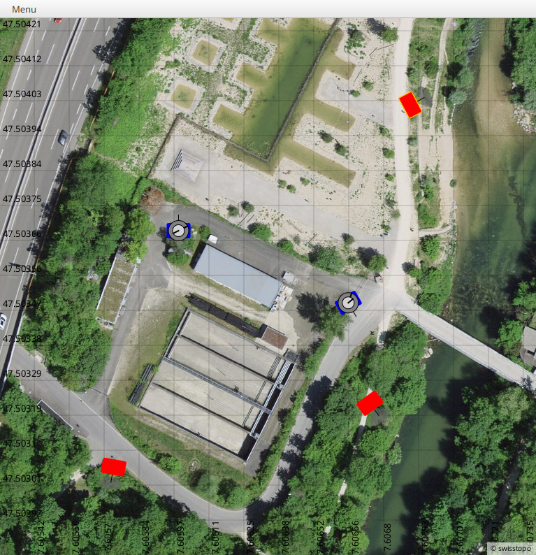

# mitwelten-bricks-app

## About the Project
This project is used to test scenarios with distributed sensors and actuators. Therefore, the sensors and actuators communicate either via the Internet with the application or are simulated by it. The goal is to create a test environment to develop algorithms, such as for a guidance system.


### Built With
The following technologies were used for the implementation of the project:
* [Java](https://www.java.com/de/)
* [JavaFX](https://openjfx.io/)
* [Gradle](https://gradle.org/)
* [MQTT](https://mqtt.org/)
 
### Dependencies 
* [Eclipse Paho Client Mqttv3](https://www.eclipse.org/paho/)
* [FHNW IOT Bricks Project](https://github.com/mitwelten/fhnw-iot-bricks)

## Getting Started

### Prerequisites
Make sure, you have the following installed:
- Java 17 or newer
- Gradle 8
 
Check out the [Source Code](https://github.com/mitwelten/mitwelten-bricks-app) from GitHub.
```shell
git clone https://github.com/mitwelten/mitwelten-bricks-app.git
```
Run the application:
```shell
gradle run
```
### Clean up
To clean up the `build` folder:

```shell
gradle clean 
```

## Testing
Run the tests:
```shell
gradle test
```

## Documentation

### Architecture
The architecture is implemented according to the MVC architecture pattern. 
For this purpose, the application was implemented using the JavaFX MVC template from the [University FHNW](https://www.fhnw.ch/en/). 
For more information see  [JavaFX MVC-Template](https://github.com/Pi4J/pi4j-template-javafx).

### Project Structure
```
/
├─── artifactory.gradle           (settings for repo.webis.de: do not touch)
├─── bin/                         (compiled binaries; not committed, in .gitignore)
├─── build/                       (generated build files; not committed, in .gitignore)
├─── build.gradle                 (project settings)
├─── .gitignore
├─── gradle/                      (Gradle distribution to build this project)
├─── .gradle/                     (not committed, in .gitignore)
├─── gradlew                      (Unix command for Gradle)
├─── gradlew.bat                  (Windows command for Gradle)
├─── libs                         (Local dependencies)
├─┬─ src/                         (Source Code)
│ ├─┬─ main/
│ │ ├─── java/                    (Java classes)
│ │ └─── resources/               (Resources used by the Java classes)
│ └─┬─ test/
│   └─── java                     (Java test classes)
├─── Readme.md
├─── LICENCE 
└─── settings.gradle              (project name configuration)
```

### Reference Documentation
For further reference, please consider the following sections:
* [Official Gradle documentation](https://docs.gradle.org)

## License
This project is licensed under the [MIT License](https://choosealicense.com/licenses/mit/). 
Feel free to modify and distribute it as needed.

## Contact
- [Andri Wild](mailto:andri.wild@fhnw.ch)
- [Prof. Thomas Amberg](mailto:thomas.amberg@fhnw.ch)